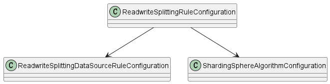

# sharding-jdbc 主从读写分离示例

## 1. 配置说明

涉及三个类 `ReadwriteSplittingRuleConfiguration`、`ReadwriteSplittingDataSourceRuleConfiguration`和`ShardingSphereAlgorithmConfiguration`

1. `ReadwriteSplittingDataSourceRuleConfiguration` 主要用于封装读写分离数据源的基本配置、类型和负载均衡算法名称
2. `ShardingSphereAlgorithmConfiguration` 主要用于封装从库负载均衡算法配置
   1. ROUND_ROBIN 轮询算法
   2. RANDOM 随机访问算法
   3. WEIGHT 权重访问算法
3. `ReadwriteSplittingRuleConfiguration` 主要用于封装读写分离的总规则配置

